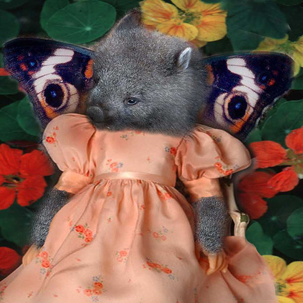
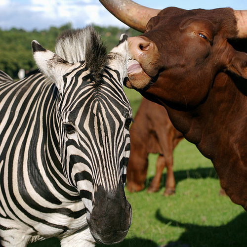

# ImageNetBiodiversity Repository

## Description
Repository of data to accompany the paper "Bugs in the Data: How ImageNet Misrepresents Biodiversity" 

   
    
    
    

## Link to Paper 
(forthcoming)

## Citation
(forthcoming)
